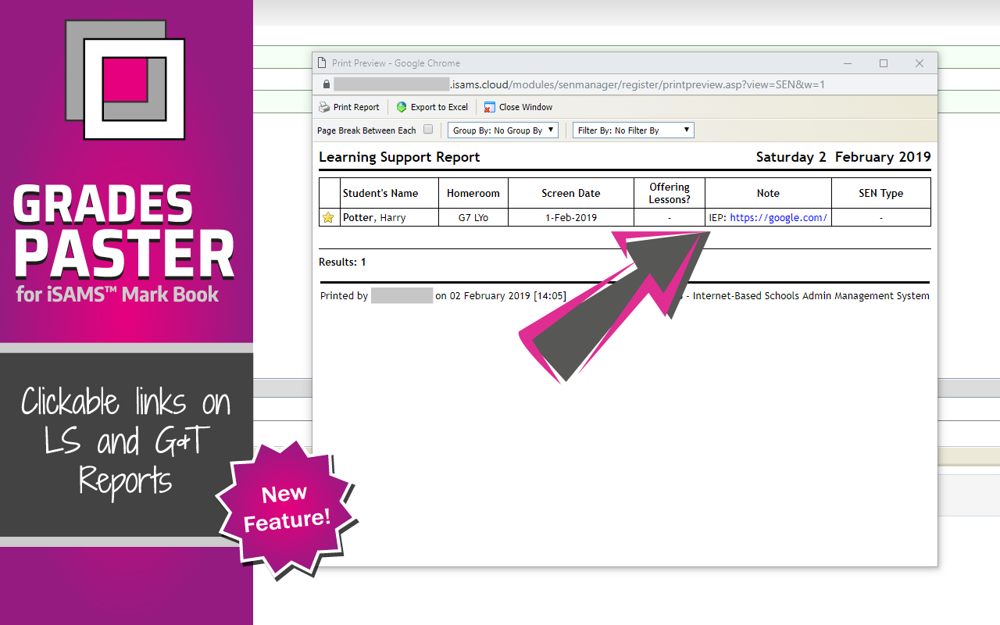

**GradesPaster for iSams Mark Book** (GradesPaster for short) is a Google Chrome extension that enables pasting grades into a mark book in iSams from Google Steets, Excel or similar sources - no more endless clicking and selecting each grade individually!. It now also  makes URLs in the Note field in Learning Support (LS and G&T) Reports clickable when you preview these reports, and works in the new iSams user interface.

I created GradesPaster extension after I had to start using Mark Books in iSams and discovered there was no built-in copy-paste functionality. The idea of having to click thousands of times to enter all the grades for reports did not sit well with me, so I made this extension. As I work with iSams more and more, I will be adding other features to GradesPaster that improve user interface and functionality of iSams to make my life as a teacher and iSams administrator easier. Hope it makes your life a little easier, too!

The extension loads automatically (can be turned off on the Options page - see below) on iSams Mark Book pages when in 'editing' mode. Currently it only lets you paste one column of grades at a time. On the very first paste, Google Chrome will prompt you to _'allow isams.cloud website to access your clipboard'_ - make sure to click "Allow", or you won't be able to paste any grades!



GradesPaster does not require any special permissions beyond knowing when you are on isams.cloud website. No personal user data is collected by this extension.

### Features

- **NEW**: On LS and G&T Report print preview pages, converts URLs in Notes field into clickable links - now LS admins can put a link to a shared Google Doc into student Notes, instead of having to upload a document, and re-upload every time it is updated!
- **NEW**: now also works in new iSams user interface!
- On iSams Mark Book page with mark book is 'edit' mode, lets you copy/paste grades from external source (Google Sheet, MS Excel, or similar). Grades can be pasted one column at a time (for now)
- Loads automatically (can be disabled in Options - see below)
- Simple, guided user interface
- Data validation built-in:
  * Checks that number of grades being pasted matches number of students in the mark book
  * Checks that values being pasted match the grade values accepted in the column being pasted into

### Options

- Enable/disable automatic loading of GradesPaster on mark book pages in iSams

To access GradesPaster options, right-click on the extension's icon in the Chrome toolbar and select _'Options'_.

When automatic loading is disabled, you can still manually start GradesPaster on a mark book page by right-clicking on the mark book and selecting _GradesPaster for iSams Mark Book_ item.

### Reporting Issues / Feature Requests

Please report any issues or suggest feature ideas on the [Issues page](https://github.com/azadisaryev/iSamsMBP/issues).

### Feature Images

